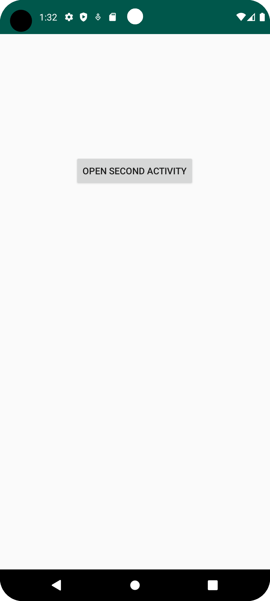
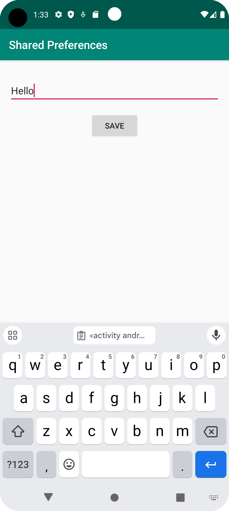
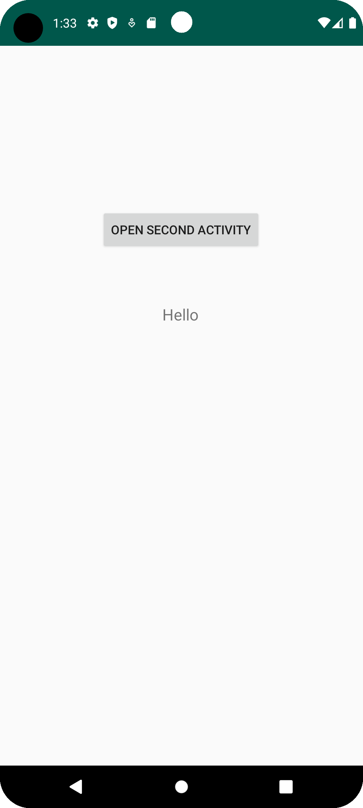

# Rapport

Skapade en Button som öppnar Second Activity och en TextView som kommer att visa shared preference i activity_main.xml:
```
    <Button
        android:id="@+id/btnOpenSecondActivity"
        android:layout_width="wrap_content"
        android:layout_height="wrap_content"
        android:layout_marginTop="168dp"
        android:text="Open Second Activity"
        app:layout_constraintEnd_toEndOf="parent"
        app:layout_constraintHorizontal_bias="0.497"
        app:layout_constraintStart_toStartOf="parent"
        app:layout_constraintTop_toTopOf="parent" />

    <TextView
        android:id="@+id/tvData"
        android:layout_width="wrap_content"
        android:layout_height="wrap_content"
        android:layout_marginTop="16dp"
        android:text="Data from Second Activity:"
        android:textSize="18sp"
        app:layout_constraintBottom_toBottomOf="parent"
        app:layout_constraintEnd_toEndOf="parent"
        app:layout_constraintHorizontal_bias="0.497"
        app:layout_constraintStart_toStartOf="parent"
        app:layout_constraintTop_toBottomOf="@+id/btnOpenSecondActivity"
        app:layout_constraintVertical_bias="0.083" />
```

Skapade activity_second.xml och lade till en EditText som kommer att ta emot data och en Button som kommer att spara data:

```
    <EditText
        android:id="@+id/etData"
        android:layout_width="0dp"
        android:layout_height="wrap_content"
        android:layout_marginTop="188dp"
        android:hint="Enter data"
        app:layout_constraintEnd_toEndOf="parent"
        app:layout_constraintHorizontal_bias="0.0"
        app:layout_constraintStart_toStartOf="parent"
        app:layout_constraintTop_toTopOf="parent" />

    <Button
        android:id="@+id/btnSave"
        android:layout_width="wrap_content"
        android:layout_height="wrap_content"
        android:layout_marginTop="28dp"
        android:text="Save"
        app:layout_constraintEnd_toEndOf="parent"
        app:layout_constraintHorizontal_bias="0.498"
        app:layout_constraintStart_toStartOf="parent"
        app:layout_constraintTop_toBottomOf="@+id/etData" />
```


I MainActivity.java specifierar vad Button gör, vilket är öppna Second Activity. Sedan finns det TextView som är först tomt men onResume kommer att läsa av Shared Preferences som sedan visas i TextView:
```
        sharedPreferences = getSharedPreferences("myPrefs", MODE_PRIVATE);

        Button btnOpenSecondActivity = findViewById(R.id.btnOpenSecondActivity);
        tvData = findViewById(R.id.tvData);

        btnOpenSecondActivity.setOnClickListener(view -> {
            startActivity(new Intent(this, SecondActivity.class));
```

```
    @Override
    protected void onResume() {
        super.onResume();
        String data = sharedPreferences.getString("data", "");
        tvData.setText(data);
    }
```


I SecondActivity.java finns det en EditText och en button. När button "Save" trycks sparar datan i EditText i shared preferences och sedan stänger SecondActivity och återgår till MainActivity:

```
        sharedPreferences = getSharedPreferences("myPrefs", MODE_PRIVATE);

        EditText etData = findViewById(R.id.etData);
        Button btnSave = findViewById(R.id.btnSave);

        btnSave.setOnClickListener(view -> {
            String data = etData.getText().toString();
            sharedPreferences.edit().putString("data", data).apply();
            finish();
```






